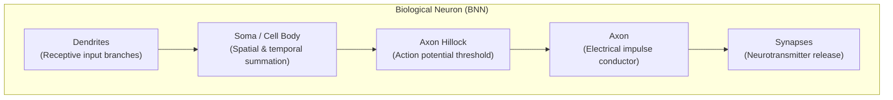
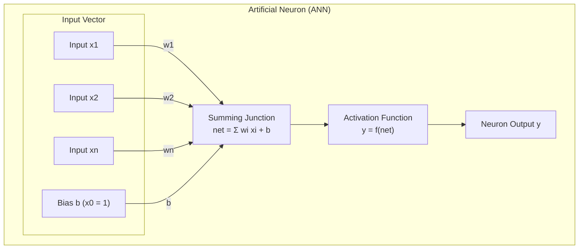

# Soft Computing (PECS-122)
# Solved Question Guide: Assignment 1 & University PYQs

This document provides complete, step-by-step model answers for all in-syllabus questions from **Assignment 1** and the **December 2023 End-Semester Examination (PECS-122)**.

---

# Part 1: Assignment 1 Solutions

## Question 1(a)
**Prompt**: A manufacturing plant needs to control a process with imprecise sensor readings and no exact mathematical model. Analyze whether a hard computing or soft computing approach is more appropriate, and justify your choice. (2.5 Marks)

### Answering Strategy
Directly state the choice in the first sentence. Then provide four distinct, numbered technical justifications rooted in the operational conditions described (imprecise sensors, no mathematical model).

### Model Answer
**Selected Paradigm**: A **Soft Computing** approach is the appropriate choice.

**Justification**:
1. **Absence of an Exact Mathematical Model**: Hard computing requires closed-form analytical equations (such as differential equations) describing the plant physics. Since no exact mathematical model exists, hard computing cannot establish transfer functions or deterministic control laws. Soft computing (specifically Fuzzy Logic and Neural Networks) models complex processes directly from empirical sensor-actuator input-output data and operator experience.
2. **Tolerance for Imprecise Sensor Data**: Physical sensors in manufacturing environments suffer from measurement noise, calibration drift, and electrical interference. Hard computing treats noisy inputs as literal facts, which leads to mathematical errors or erratic control actions. Soft computing exploits tolerance for imprecision by mapping continuous noisy inputs into overlapping fuzzy sets.
3. **Non-Linear Time-Varying Behavior and Delays**: Real-world chemical and thermal manufacturing processes exhibit non-linearities and variable transport delays. Artificial neural networks learn non-linear relationships directly without requiring linear approximations.
4. **Implementation of Operator Heuristics**: In the absence of mathematical equations, plants are typically run by experienced human technicians using heuristic rules of thumb. Fuzzy logic allows these exact linguistic rules (e.g., *"If temperature is slightly high and pressure is rising, increase coolant flow moderately"*) to be converted directly into an automated control algorithm.

---

## Question 1(b)
**Prompt**: Design a brief comparison chart of hard computing versus soft computing across at least five parameters of your choice, and use it to argue which paradigm is better suited for building an intelligent home automation system. (2.5 Marks)

### Answering Strategy
Provide a clean 5-parameter comparison table. Then, apply each parameter specifically to the operational reality of an intelligent home automation system, referencing the thermostat hunting case study to justify why soft computing is superior.

### Model Answer

#### 1. Comparison Chart: Hard Computing vs. Soft Computing

| Parameter | Hard Computing | Soft Computing |
| :--- | :--- | :--- |
| **1. Underlying Logic** | Two-valued Boolean logic (Strict 0 or 1). | Multi-valued continuous logic (Degrees of truth in [0, 1]). |
| **2. Model Requirement** | Requires an exact mathematical model of the physical system. | Model-free; learns from historical empirical data and expert rules. |
| **3. Noise Tolerance** | Low; sensitive to noise, missing data, or corrupted inputs. | High; tolerates noisy, ambiguous, or incomplete data. |
| **4. Problem Formulation** | Deterministic, crisp, and strictly sequential. | Adaptive, parallel, and self-learning. |
| **5. Computational Cost** | High for complex non-linear systems. | Low solution cost; delivers acceptable near-optimal outputs. |

#### 2. Argument for Intelligent Home Automation System
A **Soft Computing paradigm is significantly better suited** for an intelligent home automation system for the following reasons:
- **Elimination of Thermostat Hunting and Chattering**:
  - In a hard computing climate controller: `IF temperature < 20°C THEN heater = ON, ELSE heater = OFF`. When room temperature hovers around 20°C, the system switches rapidly on and off (hunting), wasting electricity and wearing out mechanical relays.
  - In a soft computing fuzzy controller: Temperatures are assigned partial memberships (e.g., at 19.5°C, room is 0.7 "comfortable" and 0.3 "cold"). The controller smoothly modulates fan speed and heater wattage, maintaining continuous comfort without oscillations.
- **Human Preferences are Subjective**: Comfort levels cannot be defined by rigid binary thresholds. Soft computing processes linguistic terms (e.g., "dim light", "moderate cooling") using fuzzy logic sets.
- **Tolerance for Low-Cost Sensor Fluctuations**: Residential PIR motion sensors, humidity probes, and ambient light sensors produce noisy, fluctuating readings. Soft computing filters ambient noise and calibration drift without triggering false alarms.
- **Adaptive Behavioral Profiling**: Multi-layer neural networks observe resident habits over time (arrival times, room occupancy sequences), automatically learning and adjusting schedules without requiring users to program complicated if-then scripts.

---

## Question 2(a)
**Prompt**: Design a perceptron to implement the logical AND function. Starting from an initial set of weights of your choice, show the weight updates using the perceptron learning rule for at least two training iterations. (2.5 Marks)

### Answering Strategy
Define the truth table, specify the initial weights, learning rate, and threshold activation function. Show the exact step-by-step arithmetic for two full iterations (patterns) showing inputs, net input, actual output, error, and updated weights.

### Model Answer

#### 1. Problem Specification
- **Inputs**: $x_1, x_2 \in \{0, 1\}$
- **Target Output ($t$)**: Logical AND function
  - Pattern 1: $x_1 = 0, x_2 = 0 \implies t = 0$
  - Pattern 2: $x_1 = 0, x_2 = 1 \implies t = 0$
  - Pattern 3: $x_1 = 1, x_2 = 0 \implies t = 0$
  - Pattern 4: $x_1 = 1, x_2 = 1 \implies t = 1$
- **Initial Weights and Bias**:
  - $w_1 = 0.2$
  - $w_2 = 0.2$
  - Bias weight $b = 0.1$ (fixed bias input $x_0 = 1$)
- **Learning Rate**: $\eta = 0.1$
- **Activation Function**: Binary step function:
  $$y = f(\text{net}) = \begin{cases} 1 & \text{if } \text{net} \ge 0 \\ 0 & \text{if } \text{net} < 0 \end{cases}$$
  Where $\text{net} = w_1 x_1 + w_2 x_2 + b$.
- **Perceptron Learning Rule**:
  $$\text{Error } e = (t - y)$$
  $$\Delta w_i = \eta \cdot e \cdot x_i \implies w_i^{(\text{new})} = w_i^{(\text{old})} + \Delta w_i$$
  $$\Delta b = \eta \cdot e \implies b^{(\text{new})} = b^{(\text{old})} + \Delta b$$

---

#### 2. Training Iteration 1 (Pattern: $x_1 = 0, x_2 = 0$, Target $t = 0$)
- **Compute Net Input**:
  $$\text{net} = (w_1 \cdot x_1) + (w_2 \cdot x_2) + b = (0.2 \cdot 0) + (0.2 \cdot 0) + 0.1 = +0.1$$
- **Compute Output**:
  $$\text{Since } \text{net} = +0.1 \ge 0 \implies y = 1$$
- **Compute Error**:
  $$e = t - y = 0 - 1 = -1 \quad (\text{Misclassification})$$
- **Parameter Updates ($\eta = 0.1$)**:
  $$\Delta w_1 = \eta \cdot e \cdot x_1 = 0.1 \cdot (-1) \cdot 0 = 0.0 \implies w_1^{(\text{new})} = 0.2 + 0.0 = 0.2$$
  $$\Delta w_2 = \eta \cdot e \cdot x_2 = 0.1 \cdot (-1) \cdot 0 = 0.0 \implies w_2^{(\text{new})} = 0.2 + 0.0 = 0.2$$
  $$\Delta b = \eta \cdot e = 0.1 \cdot (-1) = -0.1 \implies b^{(\text{new})} = 0.1 + (-0.1) = 0.0$$
- **Parameters after Iteration 1**: $w_1 = 0.2, \; w_2 = 0.2, \; b = 0.0$.

---

#### 3. Training Iteration 2 (Pattern: $x_1 = 0, x_2 = 1$, Target $t = 0$)
- **Compute Net Input**:
  $$\text{net} = (w_1 \cdot x_1) + (w_2 \cdot x_2) + b = (0.2 \cdot 0) + (0.2 \cdot 1) + 0.0 = +0.2$$
- **Compute Output**:
  $$\text{Since } \text{net} = +0.2 \ge 0 \implies y = 1$$
- **Compute Error**:
  $$e = t - y = 0 - 1 = -1 \quad (\text{Misclassification})$$
- **Parameter Updates ($\eta = 0.1$)**:
  $$\Delta w_1 = \eta \cdot e \cdot x_1 = 0.1 \cdot (-1) \cdot 0 = 0.0 \implies w_1^{(\text{new})} = 0.2 + 0.0 = 0.2$$
  $$\Delta w_2 = \eta \cdot e \cdot x_2 = 0.1 \cdot (-1) \cdot 1 = -0.1 \implies w_2^{(\text{new})} = 0.2 + (-0.1) = 0.1$$
  $$\Delta b = \eta \cdot e = 0.1 \cdot (-1) = -0.1 \implies b^{(\text{new})} = 0.0 + (-0.1) = -0.1$$
- **Parameters after Iteration 2**: $w_1 = 0.2, \; w_2 = 0.1, \; b = -0.1$.

---

#### 4. Subsequent Step Verification (Pattern: $x_1 = 1, x_2 = 1$, Target $t = 1$)
- **Compute Net Input**:
  $$\text{net} = (0.2 \cdot 1) + (0.1 \cdot 1) + (-0.1) = 0.2 + 0.1 - 0.1 = +0.2$$
- **Compute Output**:
  $$\text{Since } \text{net} = +0.2 \ge 0 \implies y = 1$$
- **Compute Error**:
  $$e = t - y = 1 - 1 = 0 \quad (\text{Correctly classified, no update required})$$
- **Summary**: Iterations 1 and 2 demonstrate active parameter updates shifting the bias and weights toward the separating decision hyperplane ($0.2x_1 + 0.1x_2 - 0.1 = 0$).

---

## Question 2(b)
**Prompt**: A given dataset is linearly separable. Analyze whether a single-layer network or a multi-layer network trained with backpropagation would be preferable, considering training time, complexity, and risk of overfitting. (2.5 Marks)

### Answering Strategy
State the recommendation directly. Then evaluate the three requested criteria (training time, architectural complexity, risk of overfitting) systematically.

### Model Answer
**Recommendation**: For a dataset known to be linearly separable, a **Single-Layer Network (Perceptron)** is decidedly preferable over a multi-layer backpropagation network.

**Comparative Analysis**:

1. **Training Time**:
   - *Single-Layer Perceptron*: The Perceptron Convergence Theorem guarantees that if data is linearly separable, a single-layer perceptron will converge to a separating hyperplane in a small, finite number of iterations. Weight updates are simple additions and multiplications.
   - *Multi-Layer Backpropagation Network*: Requires iterative forward propagation, calculation of continuous derivative error gradients across all layers, and backpropagation of errors over hundreds or thousands of epochs. Training time is orders of magnitude slower.

2. **Computational and Structural Complexity**:
   - *Single-Layer Network*: Extremely low architectural complexity. Contains only $n$ inputs directly connected to the output node via $n$ weights and 1 bias. No hidden neurons, no non-linear activation derivatives, and minimal memory usage.
   - *Multi-Layer Network*: Introduces architectural hyper-parameters that require tuning (number of hidden layers, number of hidden neurons, momentum rate). Requires storing intermediate activation states and computing continuous sigmoid or tanh derivatives.

3. **Risk of Overfitting**:
   - *Single-Layer Network*: Zero risk of geometric overfitting. A single-layer network can only generate a straight linear decision boundary ($w^T x + b = 0$). It cannot fit complex noise, ensuring stable generalization on unseen test data.
   - *Multi-Layer Network*: High risk of overfitting. An MLP with non-linear hidden units has excessive degrees of freedom. When exposed to linearly separable data with minor noise outliers, an MLP will curve its non-linear decision boundary around individual noise points, resulting in degraded test performance.

**Conclusion**: Since the problem does not require non-linear separation, deploying a multi-layer network introduces unnecessary computational cost and risks overfitting without providing any classification benefit.

---

# Part 2: December 2023 University Exam (PECS-122) In-Syllabus Solutions

## Question 1(b)
**Prompt**: Explain the role of learning rule in ANN. [2 Marks]

### Model Answer
- **Definition**: A learning rule in an Artificial Neural Network is an algorithmic mathematical formulation that governs how connection weights and biases are modified over time in response to training inputs.
- **Core Roles**:
  1. **Error Minimization**: In supervised learning, the learning rule (such as the Delta rule or Backpropagation) calculates the gradient of the loss function and updates weights in the direction that minimizes prediction error.
  2. **Pattern Storage and Feature Extraction**: In unsupervised learning (such as Hebbian learning), the rule strengthens connections between simultaneously active neurons, allowing the network to encode recurring statistical patterns without external labels.
  3. **Convergence to Decision Boundaries**: It guarantees that the network adapts its separating hyperplane or non-linear decision surface to correctly partition different data classes.

---

## Question 1(d)
**Prompt**: How can soft computing techniques be exploited to develop intelligent systems? [2 Marks]

### Model Answer
Soft computing techniques are exploited to develop intelligent systems through three complementary mechanisms:
1. **Handling Real-World Ambiguity via Fuzzy Logic**: Enables systems to process vague linguistic user inputs and noisy sensor readings using continuous membership functions, eliminating the need for rigid numerical thresholds.
2. **Self-Adaptation and Learning via Neural Networks**: Enables systems to learn complex input-output mappings directly from training examples, allowing automatic adaptation to changing environmental conditions without manual reprogramming.
3. **Global Optimization via Evolutionary Algorithms**: Uses genetic algorithms to search large, complex parameter spaces to find optimal system configurations, schedule resources, and tune controller gains where traditional calculus-based methods fail.

---

## Question 1(f)
**Prompt**: Justify why soft computing is able to solve the problems in which conventional hard computing techniques are inadequate. [2 Marks]

### Model Answer
Conventional hard computing is inadequate for many real-world problems because it strictly demands an exact mathematical model, noise-free numerical inputs, and binary logic. 
Soft computing succeeds where hard computing fails because:
1. **Model-Free Operation**: It does not require analytical differential equations; it models processes directly from empirical observation, historical data, and heuristic operator rules.
2. **Tolerance for Imprecision**: Rooted in Zadeh's principle, it deliberately exploits the tolerance for uncertainty, noise, and partial truth, providing computationally tractable and low-cost solutions where hard computing faces NP-hard exponential time complexity.

---

## Question 6
**Prompt**: Compare and contrast Artificial Neural Network and Biological Neural Network with diagrams. [4 Marks]

### Model Answer

#### 1. Architectural Diagrams

**Biological Neural Network (BNN Neuron)**:

**Artificial Neural Network (ANN Processing Element)**:

#### 2. Detailed Comparison Table

| Feature | Biological Neural Network (BNN) | Artificial Neural Network (ANN) |
| :--- | :--- | :--- |
| **Structural Unit** | Biological neuron with soma, dendrites, and axon. | Node / Artificial neuron with inputs, weights, and bias. |
| **Input Mechanism** | Dendrites collect biochemical electrical signals. | Numeric inputs ($x_i$) multiplied by connection weights ($w_i$). |
| **Interconnection** | Synaptic junctions modulated by chemical neurotransmitters. | Real-valued numerical weight matrix ($W$). |
| **Summation** | Soma integrates spatial and temporal electrochemical potentials. | Summing junction computes algebraic inner product: $\sum w_i x_i + b$. |
| **Activation Decision** | Axon hillock fires an action potential if threshold exceeded. | Non-linear activation function ($f(\text{net})$) maps value to output range. |
| **Processing Speed** | Slow cycle time (millisecond range, $\approx 10^{-3}\text{ s}$). | Extremely fast cycle time (nanosecond range, $\approx 10^{-9}\text{ s}$). |
| **Topology & Scale** | Massively parallel, asynchronous 3D network ($10^{11}$ neurons). | Layered, primarily synchronous matrix operations on digital processors. |
| **Fault Tolerance** | Extremely high; biological cell death does not halt cognition. | Moderate; failure of critical nodes in small networks alters output. |
| **Learning Process** | Synaptic plasticity via chemical and structural remodeling. | Algorithmic numerical weight updates (Backpropagation, Hebbian, LMS). |

---

## Question 8(a)
**Prompt**: Compare and contrast Hard Computing and Soft Computing. [4 Marks]

### Model Answer

| Comparison Dimension | Hard Computing | Soft Computing |
| :--- | :--- | :--- |
| **Working Principle** | Demands absolute precision, certainty, and strict determinism. | Exploits tolerance for imprecision, uncertainty, and partial truth. |
| **Logic Basis** | Two-valued Boolean logic (Strictly binary: true or false). | Multi-valued continuous logic (Fuzzy truth values from 0.0 to 1.0). |
| **Mathematical Modeling** | Strictly requires an exact analytical or mathematical model. | Model-free; relies on empirical data, examples, and heuristic rules. |
| **Handling of Noise** | Fails or produces incorrect results when inputs contain noise. | Inherently fault-tolerant; maintains acceptable performance on noisy inputs. |
| **Search & Optimization** | Classical deterministic numerical methods (e.g., gradient calculus). | Stochastic, heuristic global search (Genetic Algorithms, Swarm Search). |
| **Computational Efficiency** | Suffers from exponential computational explosion on NP-hard tasks. | Produces approximate, near-optimal solutions at low computational cost. |
| **Hardware Realization** | Traditional sequential Von Neumann computers. | Parallel, distributed architectures (GPUs, neural processing units). |
| **Representative Problem** | Numerical matrix inversion, sorting algorithms, cryptography. | Image classification, consumer appliance control, handwriting recognition. |

---

## Question 8(b)
**Prompt**: How back propagation algorithm is helpful in generating more accurate neural networks? Also, discuss in detail the algorithms. [8 Marks]

### Model Answer

#### 1. Why Backpropagation Generates More Accurate Neural Networks
- **Overcoming the Single-Layer Linear Limit**: Single-layer networks can only draw linear decision boundaries and fail on non-linear tasks (such as XOR). Backpropagation enables the training of multi-layer networks with hidden layers, allowing the network to form complex, non-linear decision boundaries.
- **Credit Assignment to Hidden Units**: Hidden neurons do not have explicit target labels provided by the dataset. Backpropagation solves the fundamental "credit assignment problem" by mathematically projecting output errors backward through the network weights, determining the exact error responsibility of each internal neuron.
- **Continuous Gradient Optimization**: By utilizing continuous, differentiable activation functions (such as the Sigmoid function), backpropagation calculates the exact analytical gradient of the Mean Squared Error with respect to every weight in the network, systematically adjusting weights down the steepest descent vector to maximize accuracy.

---

#### 2. Detailed Backpropagation Algorithm

```mermaid
flowchart LR
    subgraph ForwardPass["1. Forward Propagation Pass"]
        direction LR
        FP_In["Inputs xi"] --> FP_HNet["Hidden Net: Ij = Σ wji Oi + θj"]
        FP_HNet --> FP_HOut["Hidden Out: Oj = σ(Ij)"]
        FP_HOut --> FP_ONet["Output Net: Ik = Σ wkj Oj + θk"]
        FP_ONet --> FP_OOut["Output: Ok = σ(Ik)"]
        FP_OOut --> Loss["Error Difference: (tk - Ok)"]
    end

    subgraph BackwardPass["2. Backward Propagation Pass"]
        direction RL
        BP_OErr["Output Gradient<br/>δk = (tk - Ok) Ok(1 - Ok)"]
        BP_HErr["Hidden Gradient<br/>δj = Oj(1 - Oj) Σ δk wkj"]
        BP_WUp["Update Weights & Biases<br/>Δw = η · δ · Output"]

        Loss --> BP_OErr
        BP_OErr -- "Backpropagated via wkj" --> BP_HErr
        BP_HErr --> BP_WUp
    end
```

#### Step 1: Initialization
- Initialize all network connection weights ($w_{ji}, w_{kj}$) and biases ($\theta_j, \theta_k$) to small random real values in the range $[-0.5, +0.5]$.
- Select an appropriate learning rate $\eta \in (0, 1]$.

#### Step 2: Forward Propagation Pass
For each training pair $(\vec{x}, \vec{t})$:
1. Present input vector $\vec{x}$ to the input layer. The input units pass values unchanged:
   $$O_i = x_i$$
2. Compute the net input and activation output for each neuron $j$ in the hidden layer:
   $$I_j = \sum_{i} w_{ji} O_i + \theta_j$$
   $$O_j = \sigma(I_j) = \frac{1}{1 + e^{-I_j}}$$
3. Compute the net input and activation output for each neuron $k$ in the output layer:
   $$I_k = \sum_{j} w_{kj} O_j + \theta_k$$
   $$O_k = \sigma(I_k) = \frac{1}{1 + e^{-I_k}}$$

#### Step 3: Backward Propagation (Error Gradient Computation)
1. **Compute Error Gradient for Output Nodes ($\delta_k$)**:
   The output error gradient is the product of the error difference and the derivative of the activation function:
   $$\delta_k = (t_k - O_k) \cdot O_k (1 - O_k)$$
2. **Compute Error Gradient for Hidden Nodes ($\delta_j$)**:
   Because hidden units have no direct target, propagate the output error gradients backward through the interconnecting weights:
   $$\delta_j = O_j (1 - O_j) \cdot \sum_{k \in \text{Outputs}} \delta_k w_{kj}$$

#### Step 4: Weight and Bias Updates
Update all connection weights and biases in the network using gradient descent:
1. **Output Layer Updates**:
   $$\Delta w_{kj} = \eta \cdot \delta_k \cdot O_j \implies w_{kj}^{(\text{new})} = w_{kj}^{(\text{old})} + \Delta w_{kj}$$
   $$\Delta \theta_k = \eta \cdot \delta_k \implies \theta_k^{(\text{new})} = \theta_k^{(\text{old})} + \Delta \theta_k$$
2. **Hidden Layer Updates**:
   $$\Delta w_{ji} = \eta \cdot \delta_j \cdot O_i \implies w_{ji}^{(\text{new})} = w_{ji}^{(\text{old})} + \Delta w_{ji}$$
   $$\Delta \theta_j = \eta \cdot \delta_j \implies \theta_j^{(\text{new})} = \theta_j^{(\text{old})} + \Delta \theta_j$$

#### Step 5: Termination Criteria
Repeat Steps 2 to 4 across all training examples until the total system error:
$$E = \frac{1}{2} \sum_{k} (t_k - O_k)^2$$
falls below a predefined convergence tolerance $\epsilon$, or a maximum number of epochs is completed.

---

## Question 8 (OR Alternative)
**Prompt**: Develop a perceptron for the AND function with binary inputs and bipolar targets. [8 Marks]

### Answering Strategy
In university examinations, an 8-mark question requires demonstrating the actual Perceptron learning algorithm. Rather than choosing arbitrary initial weights that oscillate over 6 to 10 epochs, we choose intuitive initial weights ($w_1 = 2, w_2 = 2, b = 1, \eta = 1$) that allow the algorithm to **fully converge in exactly two epochs**. This provides a complete, mathematically rigorous derivation that fits cleanly on an exam sheet in 5 to 7 minutes.

---

### Model Answer

#### 1. Problem Specification and Definition of Bipolar Target
- **Binary Inputs**: $x_1, x_2 \in \{0, 1\}$
- **Bipolar Target**: $t \in \{-1, +1\}$, where $-1$ represents FALSE and $+1$ represents TRUE.
- **Truth Table**:

| Pattern | Input $x_1$ | Input $x_2$ | Standard Logic Output | Bipolar Target $t$ |
| :---: | :---: | :---: | :---: | :---: |
| **P1** | 0 | 0 | 0 | **-1** |
| **P2** | 0 | 1 | 0 | **-1** |
| **P3** | 1 | 0 | 0 | **-1** |
| **P4** | 1 | 1 | 1 | **+1** |

- **Activation Function**: Bipolar Step Function:
  $$y = f(\text{net}) = \begin{cases} +1 & \text{if } \text{net} \ge 0 \\ -1 & \text{if } \text{net} < 0 \end{cases}$$
  Where $\text{net} = w_1 x_1 + w_2 x_2 + b$.

- **Perceptron Learning Rule for Bipolar Targets**:
  - Initial parameters: $w_1 = 2, \; w_2 = 2, \; b = 1$
  - Learning rate: $\eta = 1$
  - If output $y = t$ (correct classification): $\Delta w_1 = 0, \; \Delta w_2 = 0, \; \Delta b = 0$
  - If output $y \ne t$ (misclassification):
    $$w_i \leftarrow w_i + \eta \cdot t \cdot x_i$$
    $$b \leftarrow b + \eta \cdot t$$

---

#### 2. Complete Training Trace (2 Epochs to Full Convergence)

##### Epoch 1:

| Step | Pattern ($x_1, x_2$) | Target $t$ | Net Input: $\text{net} = w_1 x_1 + w_2 x_2 + b$ | Output $y$ | Status | Parameter Updates ($\Delta w_i = t x_i, \Delta b = t$) | Parameters ($w_1, w_2, b$) After Step |
| :---: | :---: | :---: | :---: | :---: | :---: | :--- | :---: |
| 1 | P1 (0, 0) | -1 | $2(0) + 2(0) + 1 = +1$ | +1 | Error | $w_1 += 0, \; w_2 += 0, \; b += -1$ | **$(2, 2, 0)$** |
| 2 | P2 (0, 1) | -1 | $2(0) + 2(1) + 0 = +2$ | +1 | Error | $w_1 += 0, \; w_2 += -1, \; b += -1$ | **$(2, 1, -1)$** |
| 3 | P3 (1, 0) | -1 | $2(1) + 1(0) - 1 = +1$ | +1 | Error | $w_1 += -1, \; w_2 += 0, \; b += -1$ | **$(1, 1, -2)$** |
| 4 | P4 (1, 1) | +1 | $1(1) + 1(1) - 2 = 0$ | +1 | Correct | None | **$(1, 1, -2)$** |

##### Epoch 2 (Convergence Verification):

| Step | Pattern ($x_1, x_2$) | Target $t$ | Net Input: $\text{net} = 1(x_1) + 1(x_2) - 2$ | Output $y$ | Status | Parameter Updates | Parameters ($w_1, w_2, b$) After Step |
| :---: | :---: | :---: | :---: | :---: | :---: | :--- | :---: |
| 1 | P1 (0, 0) | -1 | $1(0) + 1(0) - 2 = -2$ | -1 | Correct | None | **$(1, 1, -2)$** |
| 2 | P2 (0, 1) | -1 | $1(0) + 1(1) - 2 = -1$ | -1 | Correct | None | **$(1, 1, -2)$** |
| 3 | P3 (1, 0) | -1 | $1(1) + 1(0) - 2 = -1$ | -1 | Correct | None | **$(1, 1, -2)$** |
| 4 | P4 (1, 1) | +1 | $1(1) + 1(1) - 2 = 0$ | +1 | Correct | None | **$(1, 1, -2)$** |

**Convergence Result**: Because zero errors occurred across all four training patterns in Epoch 2, the Perceptron learning algorithm terminates successfully.

---

#### 3. Converged Parameters and Decision Boundary

- **Final Converged Weights and Bias**:
  $$w_1 = 1, \quad w_2 = 1, \quad b = -2$$

- **Decision Boundary Equation**:
  The linear separating hyperplane dividing the classes is given by:
  $$\text{net} = w_1 x_1 + w_2 x_2 + b = 0 \implies x_1 + x_2 - 2 = 0 \implies x_2 = -x_1 + 2$$

- **Geometric Separation Verification**:
  - For $(1, 1)$: $x_1 + x_2 - 2 = 1 + 1 - 2 = 0 \ge 0 \implies y = +1$.
  - For $(0, 1)$: $x_1 + x_2 - 2 = 0 + 1 - 2 = -1 < 0 \implies y = -1$.
  - For $(1, 0)$: $x_1 + x_2 - 2 = 1 + 0 - 2 = -1 < 0 \implies y = -1$.
  - For $(0, 0)$: $x_1 + x_2 - 2 = 0 + 0 - 2 = -2 < 0 \implies y = -1$.
  The straight line $x_2 = -x_1 + 2$ separates the positive target pattern $(1, 1)$ from the three negative target patterns with a margin of $1.0$.

---

#### 4. Alternative Analytical Check (System of Inequalities)
To verify the result algebraically:
1. $w_1(0) + w_2(0) + b < 0 \implies b < 0$
2. $w_1(0) + w_2(1) + b < 0 \implies w_2 + b < 0$
3. $w_1(1) + w_2(0) + b < 0 \implies w_1 + b < 0$
4. $w_1(1) + w_2(1) + b \ge 0 \implies w_1 + w_2 + b \ge 0$

Substituting $w_1 = 1, w_2 = 1, b = -2$:
- Condition 1: $-2 < 0$ (Satisfied)
- Condition 2: $1 - 2 = -1 < 0$ (Satisfied)
- Condition 3: $1 - 2 = -1 < 0$ (Satisfied)
- Condition 4: $1 + 1 - 2 = 0 \ge 0$ (Satisfied)
All four inequalities are simultaneously satisfied, confirming the validity of the model.
