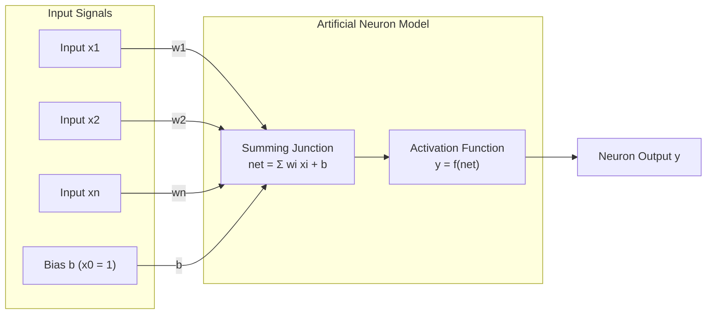
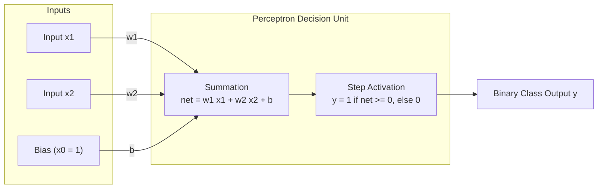
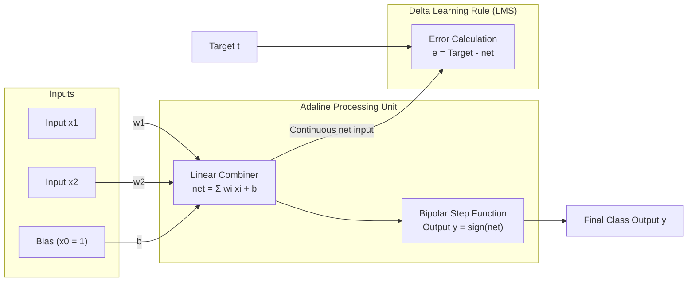
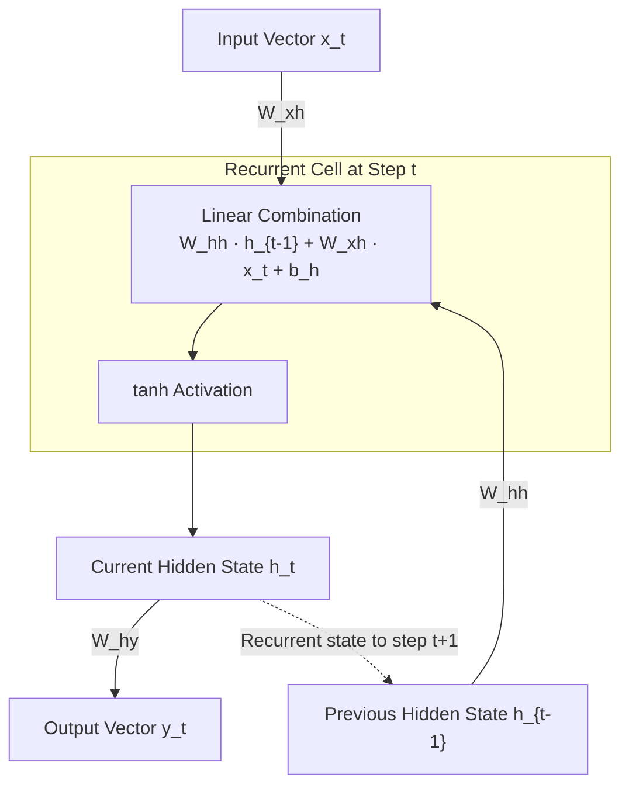
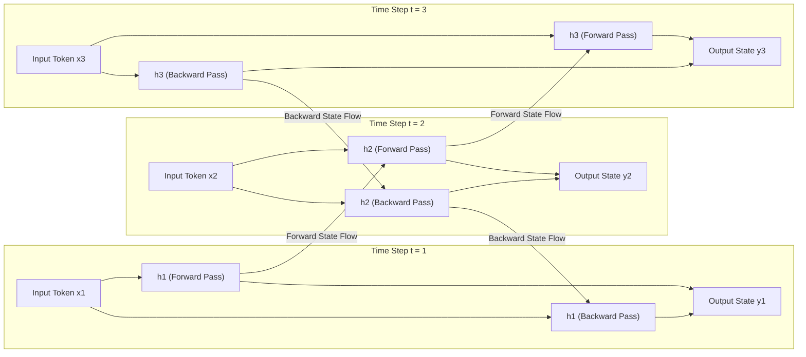

# Soft Computing (PECS-122)
# Integrated Study Notes: Introduction & Neural Networks

These notes integrate the official syllabus, teacher lecture slides, handwritten class derivations, and reference literature. The material is organized for direct technical recall, rigorous exam answering, and complete self-contained study.

---

# Module 1: Introduction to Soft Computing

## 1. Definition and Guiding Philosophy

### Definition
Soft Computing is an approach to computing that parallels the human mind's ability to reason and learn in an environment of uncertainty and imprecision. It was formalized by **Lotfi A. Zadeh** in the early 1990s.

### Guiding Principle (Zadeh's Principle)
> *"The essence of soft computing is that unlike hard computing, it exploits the tolerance for imprecision, uncertainty, and partial truth to achieve tractability, fault tolerance, and low solution cost."*

### Core Constituents of Soft Computing
Soft computing is a partnership of distinct, complementary computational methods:
1. **Fuzzy Logic (FL)**: Models imprecision and approximate reasoning using continuous degrees of truth between 0 and 1.
2. **Artificial Neural Networks (ANN)**: Provides learning, adaptation, pattern classification, and fault tolerance inspired by biological nervous systems.
3. **Genetic Algorithms / Evolutionary Computation (GA/EC)**: Provides global search and multi-objective optimization inspired by natural selection.
4. **Probabilistic Reasoning (PR)**: Evaluates uncertainty using Bayesian networks, belief networks, and chaos theory.
5. **Swarm Intelligence**: Coordinates decentralized multi-agent systems inspired by biological colonies (such as Ant Colony Optimization and Particle Swarm Optimization).

### Synergistic Hybrid Systems
These constituent techniques are complementary rather than competitive:
- **Neuro-Fuzzy Systems (ANFIS)**: Neural networks learn membership functions and fuzzy rules automatically from numerical data.
- **Genetic-Neural Systems**: Genetic algorithms optimize network architectures and initial connection weights to prevent gradient descent from getting trapped in local minima.
- **Genetic-Fuzzy Systems**: Genetic algorithms optimize rule sets and shapes of fuzzy membership functions.

---

## 2. Importance and Requirement of Soft Computing

### Why Classical (Hard) Computing Fails on Real-World Problems
Hard computing requires:
- An exact mathematical model of the physical process (e.g., differential equations).
- Completely precise and noise-free input values.
- Two-valued Boolean logic (Strict True = 1, False = 0).

Real-world engineering problems violate these assumptions:
- **Absence of Exact Mathematical Models**: Complex industrial chemical processes, ecological balances, and economic markets have too many non-linear interacting variables to be formulated into closed-form equations.
- **Sensor Noise and Calibration Drift**: Physical sensors do not deliver exact numbers; their readings contain electrical noise, environmental drift, and precision limits.
- **High Computational Complexity (NP-Hardness)**: Many optimization problems (such as vehicle routing, VLSI circuit routing, and job shop scheduling) cannot be solved to mathematical perfection within practical time limits.
- **Ambiguous Human Linguistic Inputs**: Humans communicate in subjective terms (such as "high temperature", "moderate pressure", "approaching fast"). Hard computing cannot compute directly on linguistic terms without arbitrary hard thresholds.

### How Soft Computing Overcomes These Limitations
- **Tolerates Imprecise Inputs**: Computes meaningful control outputs even when sensor inputs are noisy or partially corrupted.
- **Provides Computationally Feasible Solutions**: Accepts near-optimal solutions obtained quickly instead of requiring mathematical perfection that takes exponential time.
- **Directly Formulates Expert Heuristics**: Converts operator experience and rules of thumb into mathematical systems using fuzzy rules.

---

## 3. Worked Case Study: Hard versus Soft Computing in Practice
*(From Lecture Slides: Automatic Room-Temperature Control)*

Consider the problem of regulating room temperature using a heating unit:

```
Hard Computing Approach (Crisp Thermostat):
IF temperature < 20°C THEN heater = ON
ELSE heater = OFF
```
- **Operational Failure**: The heater operates on an all-or-nothing threshold. As temperature hovers near 20°C (e.g., oscillating between 19.9°C and 20.1°C), the heater switches rapidly ON and OFF. This behavior is called **hunting** or **chattering**, which wastes electrical energy and accelerates mechanical wear. It has no capability to distinguish between "slightly cool" (19°C) and "freezing" (5°C).

```
Soft Computing Approach (Fuzzy Logic Controller):
IF temperature IS cold THEN heater = High
IF temperature IS warm THEN heater = Low
IF temperature IS comfortable THEN heater = Maintain
```
- **Operational Success**: Temperature is mapped to continuous membership functions. At 19.5°C, the temperature belongs partially to "comfortable" (degree 0.7) and partially to "cold" (degree 0.3). The controller smoothly modulates electrical current to the heater, eliminating hunting, saving energy, and maintaining steady user comfort.

---

## 4. Evolution of Soft Computing

- **1943 (McCulloch & Pitts)**: Introduced the first mathematical model of an artificial neuron, proving that simple binary threshold units compute logical operations.
- **1958 (Rosenblatt)**: Invented the Perceptron, adding adaptive, learnable weights to the neuron model.
- **1960 (Widrow & Hoff)**: Developed the Adaline (Adaptive Linear Neuron) and the LMS (Least Mean Squares) / Delta learning rule based on gradient descent.
- **1965 (Lotfi A. Zadeh)**: Published the foundational paper on **Fuzzy Sets**, introducing continuous set membership functions to represent vagueness.
- **1975 (John Holland)**: Formulated **Genetic Algorithms** based on the mechanics of natural evolution, chromosome encoding, crossover, and mutation.
- **1980s (Commercialization in Japan)**: Industrial deployment of fuzzy systems in real-world infrastructure:
  - *Sendai Subway System (Hitachi, 1987)*: Used fuzzy logic for automatic train operation, achieving smoother acceleration and braking than human drivers.
  - *Consumer Electronics*: Sanyo and Panasonic introduced fuzzy-controlled camcorder image stabilization and washing machines that adjust cycles based on optical dirt sensors.
- **1982 (John Hopfield)**: Introduced the Hopfield Network, showing how recurrent networks store associative memory using energy minimization.
- **1986 (Rumelhart, Hinton, & Williams)**: Popularized the **Backpropagation Algorithm**, solving the problem of training multi-layer neural networks and overcoming the linear separability barrier.
- **1990s (Formalization by Zadeh)**: Zadeh unified Fuzzy Logic, Neural Networks, and Genetic Algorithms under the umbrella term **Soft Computing**, establishing the Berkeley Initiative in Soft Computing (BISC).

---

## 5. Difference Between Hard Computing and Soft Computing

| Parameter | Hard Computing (Conventional) | Soft Computing |
| :--- | :--- | :--- |
| **Guiding Principle** | Precision, certainty, and mathematical rigor. | Tolerance for imprecision, uncertainty, and partial truth. |
| **Underlying Logic** | Two-valued Boolean logic (crisp values: 0 or 1). | Multi-valued continuous logic (degrees of truth: [0, 1]). |
| **Mathematical Basis** | Requires an exact mathematical model or analytical equation. | Does not require an explicit mathematical model; uses empirical data and heuristics. |
| **Problem Formulation** | Deterministic, sequential, and strictly defined. | Stochastic, adaptive, and fault-tolerant. |
| **Search Technique** | Exhaustive search, linear programming, numerical iteration. | Heuristic, stochastic, and population-based search (e.g., GA, PSO). |
| **Handling of Noise** | Sensitive to noise; incorrect or corrupted data causes failure. | High tolerance for noisy, incomplete, or ambiguous inputs. |
| **Execution Architecture** | Typically sequential Von Neumann computer architectures. | Highly parallel and distributed processing (similar to biological networks). |
| **Output Type** | Exact numerical value or categorical decision. | Approximate numerical value or degree of membership. |
| **Computational Cost** | High for complex non-linear problems (exponential complexity). | Significantly lower solution cost for NP-hard or non-linear tasks. |
| **Representative Example** | Solving a linear system using Gaussian Elimination, sorting numbers. | Fuzzy temperature controller, handwriting recognition, genetic route optimizer. |

---

## 6. Usefulness and Practical Applications

### 1. Control Systems and Industrial Automation
- **Appliance Control**: Fuzzy logic controllers regulate motor speeds and wash cycles in washing machines based on turbidity sensor data, and modulate compressor speeds in inverter air conditioners.
- **Process Manufacturing**: Chemical reactors, cement kilns, and distillation columns with time-delayed, non-linear physical behavior use soft computing to maintain operational equilibrium where PID controllers oscillate.

### 2. Pattern Recognition and Computer Vision
- Optical Character Recognition (OCR), automated license plate recognition, fingerprint matching, and facial recognition.
- Medical imaging classification (e.g., detecting tumors in MRI and CT scans).

### 3. Smart Home Automation Systems
- Multi-sensor home automation coordinates lighting, climate, and security.
- Hard computing struggles because occupancy is unpredictable, user comfort is subjective, and ambient light levels change continuously. Soft computing integrates fuzzy comfort rules with neural adaptation to optimize power consumption without manual reprogramming.

### 4. Financial Modeling and Forecasting
- Stock market trend prediction, credit risk scoring, and credit card fraud detection using hybrid neuro-fuzzy classifiers.

### 5. Robotics and Autonomous Navigation
- Path planning in obstacle-heavy environments using genetic algorithms and swarm optimization.
- Real-time obstacle avoidance using ultrasonic and LIDAR sensor fusion processed via neural networks.

---

# Module 2: Neural Networks

## 1. Introduction and Biological Foundations

### Biological Inspiration
The human brain contains approximately 86 billion neurons interconnected by over $10^{14}$ synapses. It operates as a massively parallel, fault-tolerant, non-linear computing network.

### Biological Neuron Anatomy
1. **Dendrites**: Tree-like receptive fibers that receive electrochemical impulses from other upstream neurons.
2. **Soma (Cell Body)**: The central processing unit of the cell. It integrates incoming electrical postsynaptic potentials over time and space.
3. **Axon**: A single long transmission fiber carrying output signals away from the soma.
4. **Synapses**: Microscopic junction gaps between the axon terminal of an upstream neuron and the dendrite of a downstream neuron. Neurotransmitters modulate the electrical conductivity (synaptic strength) of the signal across the gap.

### The All-or-None Law
A biological neuron either fires completely or does not fire at all; there is no partial firing. When the accumulated membrane potential in the soma exceeds a specific biological threshold, the neuron generates an electrical action potential that travels down the axon. This threshold-based behavior was the direct biological motivation for early artificial neurons using step activation functions.

---

## 2. Artificial Neuron Model (McCulloch-Pitts & General Model)

### General Mathematical Formulation of an Artificial Neuron



1. **Input Vector**: $\vec{x} = [x_1, x_2, \dots, x_n]^T$, representing incoming feature signals.
2. **Weight Vector**: $\vec{w} = [w_1, w_2, \dots, w_n]^T$, where weight $w_i$ represents the connection strength. A positive weight indicates an excitatory input; a negative weight indicates an inhibitory input.
3. **Bias ($b$) or Threshold ($\theta$)**: 
   - A bias is an externally applied baseline parameter with an invariant input of $x_0 = 1$ and weight $w_0 = b$.
   - Mathematically, bias shifts the activation function along the horizontal axis:
   $$\text{net} = \sum_{i=1}^{n} w_i x_i + b = \vec{w}^T \vec{x} + b$$
4. **Summing Junction**: Computes the linear combination (net input) of the weighted signals plus bias.
5. **Activation Function ($f$)**: A mathematical operation that maps the continuous net input into the final output range:
   $$y = f(\text{net}) = f\left(\sum_{i=1}^{n} w_i x_i + b\right)$$

### Worked Example: Single Artificial Neuron Computation
*(From Lecture 1, Slide 13)*

**Given**:
- Inputs: $x_1 = 0.5, \; x_2 = 0.8$
- Weights: $w_1 = 0.4, \; w_2 = 0.6$
- Bias: $b = -0.3$
- Activation Function: Binary step function ($f(\text{net}) = 1 \text{ if net} \ge 0, \text{ else } 0$).

**Step 1: Compute Net Input**:
$$\text{net} = (w_1 \cdot x_1) + (w_2 \cdot x_2) + b$$
$$\text{net} = (0.4 \cdot 0.5) + (0.6 \cdot 0.8) + (-0.3) = 0.20 + 0.48 - 0.30 = 0.38$$

**Step 2: Apply Activation Function**:
Since $\text{net} = 0.38 \ge 0$, the step function outputs:
$$y = f(0.38) = 1$$

---

## 3. Comparison of Artificial Neural Network (ANN) and Biological Neural Network (BNN)

| Parameter | Biological Neural Network (BNN) | Artificial Neural Network (ANN) |
| :--- | :--- | :--- |
| **Basic Processing Unit** | Biological Neuron (Soma, Dendrites, Axon). | Node or Artificial Processing Element (PE). |
| **Signal Input** | Dendrites receiving chemical-electrical pulses. | Numerical input vector $\vec{x}$. |
| **Connection Strength** | Synaptic junctions modulated by neurotransmitters. | Real-valued numerical weights ($w_i$). |
| **Summing Mechanism** | Soma accumulates spatial and temporal potentials. | Arithmetic weighted sum ($\sum w_i x_i + b$). |
| **Threshold Decision** | Axon hillock fires an action potential if threshold reached. | Mathematical activation function $f(\text{net})$. |
| **Processing Speed** | Very slow (action potentials operate on millisecond scale, $\approx 10^{-3}\text{ s}$). | Very fast (electronic transistors operate on nanosecond scale, $\approx 10^{-9}\text{ s}$). |
| **Network Scale** | Massive ($8.6 \times 10^{10}$ neurons, $10^{14}$ synapses). | Smaller to moderate ($10^2$ to $10^{11}$ parameters in large language models). |
| **Processing Topology** | Massively parallel, asynchronous, distributed 3D architecture. | Primarily synchronous, layered, matrix-vector operations on GPUs/CPUs. |
| **Fault Tolerance** | Extremely high; daily loss of individual biological neurons does not degrade overall function. | Moderate to low; corruption of critical weights in early layers can alter outputs. |
| **Learning Mechanism** | Chemical and morphological restructuring of synapses (Hebbian plasticity). | Mathematical optimization algorithms updating weights (e.g., Backpropagation, LMS). |
| **Energy Consumption** | Extremely efficient ($\approx 20\text{ Watts}$ for the entire human brain). | High electrical energy requirement (kilowatts to megawatts for GPU clusters). |

---

## 4. Role of Learning Rules in ANN

A learning rule is an algorithmic procedure that systematically adjusts the weights and biases of a neural network to minimize performance errors or uncover data structure.

### Primary Learning Paradigms
1. **Supervised Learning**: The network is provided with input vectors along with their corresponding target output labels. Weights are adjusted based on the calculated error between network output and target output (e.g., Perceptron Rule, Delta Rule, Backpropagation).
2. **Unsupervised Learning**: The network receives only input data without target labels. It discovers statistical patterns, clusters, or feature correlations independently (e.g., Hebbian Learning, Kohonen Self-Organizing Maps).
3. **Reinforcement Learning**: The network receives feedback as an evaluative scalar reward or penalty rather than an exact target output.

---

## 5. Activation Functions

Activation functions introduce non-linearity into neural networks, enabling them to approximate complex functions beyond simple hyperplanes.

### 1. Step (Threshold / Heaviside) Function
- **Equation**:
  $$f(\text{net}) = \begin{cases} 1 & \text{if } \text{net} \ge 0 \\ 0 & \text{if } \text{net} < 0 \end{cases}$$
- **Bipolar Variant**:
  $$f(\text{net}) = \begin{cases} +1 & \text{if } \text{net} \ge 0 \\ -1 & \text{if } \text{net} < 0 \end{cases}$$
- **Output Range**: $\{0, 1\}$ or $\{-1, +1\}$.
- **Derivative**: Zero everywhere except at $\text{net} = 0$, where it is undefined (non-differentiable).
- **Use Case**: Used in classic McCulloch-Pitts neurons and Perceptrons. Cannot be used with gradient descent backpropagation because its derivative is zero everywhere.

### 2. Linear (Identity) Function
- **Equation**: $f(\text{net}) = \text{net}$
- **Derivative**: $f'(\text{net}) = 1$
- **Output Range**: $(-\infty, +\infty)$
- **Limitation**: Stacking multiple linear layers produces only another linear transformation, rendering deep architectures equivalent to a single linear layer.
- **Use Case**: Output layer of regression networks, and inside the Adaline neuron before thresholding.

### 3. Sigmoid (Logistic) Function
- **Equation**:
  $$f(\text{net}) = \sigma(\text{net}) = \frac{1}{1 + e^{-\text{net}}}$$
- **Derivative**:
  $$f'(\text{net}) = f(\text{net}) \cdot (1 - f(\text{net})) = \sigma(\text{net})(1 - \sigma(\text{net}))$$
- **Output Range**: $(0, 1)$
- **Properties**: Smooth, S-shaped, continuously differentiable. Maps real numbers to a probability-like range.
- **Limitations**:
  - *Vanishing Gradient Problem*: For large positive or negative values of $\text{net}$, the curve flattens. The derivative approaches zero ($f'(\text{net}) \approx 0$), halting weight updates in deep layers during backpropagation.
  - *Not Zero-Centered*: Outputs are strictly positive, causing zig-zagging gradient updates.

### 4. Hyperbolic Tangent (Tanh) Function
- **Equation**:
  $$f(\text{net}) = \tanh(\text{net}) = \frac{e^{\text{net}} - e^{-\text{net}}}{e^{\text{net}} + e^{-\text{net}}}$$
- **Derivative**:
  $$f'(\text{net}) = 1 - \tanh^2(\text{net}) = 1 - (f(\text{net}))^2$$
- **Output Range**: $(-1, +1)$
- **Advantage over Sigmoid**: Zero-centered (mean output is close to 0), which stabilizes gradient updates.
- **Limitation**: Still suffers from vanishing gradients at large magnitudes of $\text{net}$.

### 5. Rectified Linear Unit (ReLU)
- **Equation**:
  $$f(\text{net}) = \max(0, \text{net})$$
- **Derivative**:
  $$f'(\text{net}) = \begin{cases} 1 & \text{if } \text{net} > 0 \\ 0 & \text{if } \text{net} < 0 \end{cases}$$
- **Output Range**: $[0, +\infty)$
- **Advantages**: Fast to compute (no exponential operations). Does not saturate in the positive region, avoiding vanishing gradients for positive inputs.
- **Limitation**: "Dying ReLU" problem, where neurons with large negative net inputs output zero and have zero gradient, permanently disabling the unit.

---

## 6. Single Layer Networks and The Perceptron

### Perceptron Architecture (Frank Rosenblatt, 1958)
The Perceptron is a single-layer feedforward network with adjustable weights and a threshold activation function.



### Geometric Interpretation: Decision Boundary
For a two-input Perceptron, the decision boundary between two classes is given by the linear equation:
$$\text{net} = w_1 x_1 + w_2 x_2 + b = 0 \implies x_2 = -\frac{w_1}{w_2} x_1 - \frac{b}{w_2}$$
This is the equation of a straight line dividing the 2D input plane into two decision half-planes:
- If $w_1 x_1 + w_2 x_2 + b \ge 0 \implies y = 1$
- If $w_1 x_1 + w_2 x_2 + b < 0 \implies y = 0$ (or $-1$ for bipolar).

### Perceptron Learning Rule (Algorithm)

The update rule depends on whether the target labels are formulated as binary ($0/1$) or bipolar ($-1/+1$):

#### Form A: Binary Targets ($t \in \{0, 1\}, \; y \in \{0, 1\}$)
1. **Initialize**: Set weights $w_i$ and bias $b$ to zero or small initial values. Select learning rate $\eta \in (0, 1]$.
2. **Apply Input Pattern**: For each training vector $\vec{x}$ with target $t$:
3. **Calculate Output**:
   $$y = f(\vec{w}^T \vec{x} + b) = \begin{cases} 1 & \text{if } \text{net} \ge 0 \\ 0 & \text{if } \text{net} < 0 \end{cases}$$
4. **Compute Error**:
   $$e = (t - y)$$
5. **Update Weights and Bias**:
   $$w_i \leftarrow w_i + \Delta w_i = w_i + \eta (t - y) x_i$$
   $$b \leftarrow b + \Delta b = b + \eta (t - y)$$
6. **Repeat**: Iterate across all patterns until $e = 0$ for every sample.

#### Form B: Bipolar Targets ($t \in \{-1, +1\}, \; y \in \{-1, +1\}$)
When using a bipolar step activation function:
$$y = f(\text{net}) = \begin{cases} +1 & \text{if } \text{net} \ge 0 \\ -1 & \text{if } \text{net} < 0 \end{cases}$$
- If $y = t$ (correct classification): No update is applied ($\Delta w_i = 0, \Delta b = 0$).
- If $y \ne t$ (misclassification):
  $$w_i \leftarrow w_i + \Delta w_i = w_i + \eta \cdot t \cdot x_i$$
  $$b \leftarrow b + \Delta b = b + \eta \cdot t$$
*(Note: This updates parameters directly along the vector direction of target $t$, equivalent to $\Delta w_i = \frac{1}{2}\eta (t - y) x_i$).*

---

### Worked Example: Training a Perceptron on the Logical OR Gate
*(From Lecture 2, Slide 16)*

**Setup**:
- Initial weights: $w_1 = 0, \; w_2 = 0, \; b = 0$
- Learning rate: $\eta = 1$
- Activation Function: Binary step ($f(\text{net}) = 1 \text{ if net} \ge 0, \text{ else } 0$)
- Target: Logical OR gate ($0 \text{ OR } 0 = 0$, all other inputs give $1$).

#### Training Iterations (Epoch 1):

| Pattern ($x_1, x_2$) | Target $t$ | $\text{net} = w_1 x_1 + w_2 x_2 + b$ | Output $y$ | Error $e = t - y$ | Update Applied ($\Delta w = \eta e x, \Delta b = \eta e$) | Parameters After Step ($w_1, w_2, b$) |
| :---: | :---: | :---: | :---: | :---: | :--- | :---: |
| $(0, 0)$ | 0 | $(0)(0) + (0)(0) + 0 = 0$ | 1 | $-1$ | $w_1 += 0, w_2 += 0, b += -1$ | **$(0, 0, -1)$** |
| $(0, 1)$ | 1 | $(0)(0) + (0)(1) - 1 = -1$ | 0 | $+1$ | $w_1 += 0, w_2 += 1, b += 1$ | **$(0, 1, 0)$** |
| $(1, 0)$ | 1 | $(0)(1) + (1)(0) + 0 = 0$ | 1 | $0$ | None (Correct classification) | **$(0, 1, 0)$** |
| $(1, 1)$ | 1 | $(0)(1) + (1)(1) + 0 = 1$ | 1 | $0$ | None (Correct classification) | **$(0, 1, 0)$** |

#### Second Pass Verification:
- Pattern $(0, 0)$: $\text{net} = (0)(0) + (1)(0) + 0 = 0 \implies y = 1 \implies e = 0 - 1 = -1$.
  - Update: $w_1 \leftarrow 0, \; w_2 \leftarrow 1, \; b \leftarrow 0 + (-1) = -1$. New parameters: $(0, 1, -1)$.
- Pattern $(1, 0)$: $\text{net} = (0)(1) + (1)(0) - 1 = -1 \implies y = 0 \implies e = 1 - 0 = +1$.
  - Update: $w_1 \leftarrow 0 + 1(1) = 1, \; w_2 \leftarrow 1, \; b \leftarrow -1 + 1 = 0$. New parameters: **$(1, 1, 0)$**.
- Pattern $(0, 0)$: $\text{net} = (1)(0) + (1)(0) + 0 = 0 \implies y = 1 \implies e = -1$.
  - Update: $w_1 \leftarrow 1, \; w_2 \leftarrow 1, \; b \leftarrow 0 - 1 = -1$. New parameters: **$(1, 1, -1)$**.

**Final Convergent Parameters**: $w_1 = 1, \; w_2 = 1, \; b = -1$.
- $(0, 0) \implies \text{net} = -1 < 0 \implies y = 0$ (Correct)
- $(0, 1) \implies \text{net} = 0 \ge 0 \implies y = 1$ (Correct)
- $(1, 0) \implies \text{net} = 0 \ge 0 \implies y = 1$ (Correct)
- $(1, 1) \implies \text{net} = 1 \ge 0 \implies y = 1$ (Correct)
- Separating line: $x_1 + x_2 - 1 = 0 \implies x_2 = -x_1 + 1$.

---

### The Perceptron Convergence Theorem
If the training dataset is **linearly separable**, the Perceptron learning algorithm is guaranteed to converge to a set of separating weights in a finite number of steps.

### The Linear Separability Barrier (The XOR Problem)
In 1969, Marvin Minsky and Seymour Papert published *Perceptrons*, proving mathematically that a single-layer perceptron can only classify linearly separable input patterns.
- Logic functions like **AND**, **OR**, and **NOT** are linearly separable.
- The **XOR (Exclusive-OR)** function is **not linearly separable**: no single straight line can separate $(0, 1)$ and $(1, 0)$ (target 1) from $(0, 0)$ and $(1, 1)$ (target 0).
- Solving XOR requires at least one **hidden layer** of neurons to transform the input space non-linearly.

---

## 7. Adaline and Madaline Networks

### 1. Adaline (Adaptive Linear Neuron)
Developed by **Bernard Widrow and Ted Hoff** at Stanford University in 1960.

#### Structural Difference Between Perceptron and Adaline
- In the **Perceptron**, the error signal is computed **after** the non-linear step threshold function:
  $$e_{\text{Perceptron}} = t - f(\text{net})$$
- In the **Adaline**, the error signal is computed **before** the threshold function, directly on the continuous linear sum:
  $$e_{\text{Adaline}} = t - \text{net} = t - (\vec{w}^T \vec{x} + b)$$



#### Cost Function: Mean Squared Error (MSE)
Adaline seeks to minimize the continuous Mean Squared Error over training examples:
$$E = \frac{1}{2} (t - \text{net})^2 = \frac{1}{2} \left(t - \sum_{i} w_i x_i - b\right)^2$$

#### Derivation of the LMS (Delta / Widrow-Hoff) Rule via Gradient Descent
Gradient descent adjusts weights in the direction of steepest descent down the error surface:
$$\Delta w_i = -\eta \frac{\partial E}{\partial w_i}$$
Using the chain rule:
$$\frac{\partial E}{\partial w_i} = \frac{\partial}{\partial w_i} \left[\frac{1}{2} (t - \text{net})^2\right] = (t - \text{net}) \cdot \frac{\partial (t - \text{net})}{\partial w_i}$$
Since $\text{net} = \sum_j w_j x_j + b$, we have $\frac{\partial (t - \text{net})}{\partial w_i} = -x_i$.
Therefore:
$$\frac{\partial E}{\partial w_i} = -(t - \text{net}) x_i$$
Substituting back into the gradient descent formula:
$$\Delta w_i = -\eta \left[ -(t - \text{net}) x_i \right] = \eta (t - \text{net}) x_i$$
$$\Delta b = \eta (t - \text{net})$$

---

### Worked Example: Training an Adaline on the Bipolar AND Gate
*(From Lecture 3, Slide 15)*

**Setup**:
- Initial parameters: $w_1 = 0.1, \; w_2 = 0.1, \; b = 0.1$
- Learning rate: $\eta = 0.1$
- Bipolar inputs and targets: $x_1, x_2, t \in \{-1, +1\}$
- Bipolar AND Truth Table:
  - $(+1, +1) \implies t = +1$
  - $(+1, -1) \implies t = -1$
  - $(-1, +1) \implies t = -1$
  - $(-1, -1) \implies t = -1$

#### Training Trace (Epoch 1):

1. **Pattern 1**: $x_1 = 1, \; x_2 = 1, \; t = 1$
   - $\text{net} = (0.1)(1) + (0.1)(1) + 0.1 = 0.300$
   - Error: $e = t - \text{net} = 1 - 0.300 = 0.700$
   - Updates: $\Delta w_1 = (0.1)(0.700)(1) = 0.070, \; \Delta w_2 = 0.070, \; \Delta b = 0.070$
   - Updated parameters: **$w_1 = 0.170, \; w_2 = 0.170, \; b = 0.170$**

2. **Pattern 2**: $x_1 = 1, \; x_2 = -1, \; t = -1$
   - $\text{net} = (0.170)(1) + (0.170)(-1) + 0.170 = 0.170$
   - Error: $e = -1 - 0.170 = -1.170$
   - Updates: $\Delta w_1 = (0.1)(-1.170)(1) = -0.117, \; \Delta w_2 = (0.1)(-1.170)(-1) = +0.117, \; \Delta b = -0.117$
   - Updated parameters: **$w_1 = 0.053, \; w_2 = 0.287, \; b = 0.053$**

3. **Pattern 3**: $x_1 = -1, \; x_2 = 1, \; t = -1$
   - $\text{net} = (0.053)(-1) + (0.287)(1) + 0.053 = 0.287$
   - Error: $e = -1 - 0.287 = -1.287$
   - Updates: $\Delta w_1 = (0.1)(-1.287)(-1) = +0.129, \; \Delta w_2 = (0.1)(-1.287)(1) = -0.129, \; \Delta b = -0.129$
   - Updated parameters: **$w_1 = 0.182, \; w_2 = 0.158, \; b = -0.076$**

4. **Pattern 4**: $x_1 = -1, \; x_2 = -1, \; t = -1$
   - $\text{net} = (0.182)(-1) + (0.158)(-1) - 0.076 = -0.416$
   - Error: $e = -1 - (-0.416) = -0.584$
   - Updates: $\Delta w_1 = (0.1)(-0.584)(-1) = +0.058, \; \Delta w_2 = +0.058, \; \Delta b = -0.058$
   - Final Epoch 1 parameters: **$w_1 = 0.240, \; w_2 = 0.216, \; b = -0.134$**

Notice how the continuous error steadily drives the linear net input toward the target values.

---

### Batch versus Online (Stochastic) Learning
*(From Lecture 3, Slide 16)*

| Feature | Online (Stochastic) Learning | Batch Learning |
| :--- | :--- | :--- |
| **Weight Update Frequency** | Updated immediately after **every single training sample**. | Updated once per **epoch** after summing errors over the entire dataset. |
| **Gradient Estimation** | Noisy, instantaneous gradient approximation. | True, smooth gradient of the exact cost function. |
| **Local Minima Behavior** | Gradient noise helps escape shallow local minima and saddle points. | Moves strictly down the average gradient; can get trapped in shallow local minima. |
| **Computational Efficiency** | Fast feedback; practical for continuous real-time data streams. | Matrix-vector multiplications parallelize efficiently on modern GPU hardware. |
| **Memory Footprint** | Minimal; requires storing only the current input pattern. | Requires accumulating gradients across all training samples before updating. |

---

### Side-by-Side: Perceptron versus Adaline Comparison Table
*(From Lecture 3, Slide 17)*

| Characteristic | Perceptron (Rosenblatt, 1958) | Adaline (Widrow & Hoff, 1960) |
| :--- | :--- | :--- |
| **Where Error is Measured** | **After** the threshold activation function: $e = t - f(\text{net})$. | **Before** the threshold function on the continuous linear sum: $e = t - \text{net}$. |
| **Activation in Training** | Step function ($0/1$ or bipolar $\pm 1$). | Linear identity function ($f(\text{net}) = \text{net}$) during training; step applied only for final decision. |
| **Cost Function** | None explicitly minimized; stops when all patterns are separated. | Explicitly minimizes Mean Squared Error (MSE): $E = \frac{1}{2} (t - \text{net})^2$. |
| **Optimization Method** | Perceptron learning rule (heuristic vector addition). | Gradient Descent via the LMS (Widrow-Hoff / Delta) rule. |
| **Behavior on Non-Separable Data**| Fails to converge; weights oscillate indefinitely without stopping. | Converges reliably to the minimum mean squared error (best-fit linear boundary). |

---

### 2. Madaline (Many Adaline)
- **Architecture**: A two-layer feedforward network with multiple Adaline units in the first layer, whose outputs connect to a fixed, non-adaptive logic gate (such as an AND, OR, or Majority Vote gate) in the output layer.
- **Capability**: Because it combines multiple linear decision surfaces, Madaline classifies non-linearly separable regions (such as XOR and convex polygonal decision spaces).
- **Training Method (Madaline Rule I - MRI)**:
  - When the network output is incorrect, only the Adaline unit whose linear net input is closest to zero (the unit that requires the smallest weight change to alter its decision) is updated.
  - Output layer logic gates have fixed weights and are not updated.
- **Practical Application**: Widely deployed in telecommunication hardware for **adaptive telephone echo cancellation** and channel equalization in high-speed modems.

---

## 8. Multi-Layer Networks and Backpropagation

### Multi-Layer Perceptron (MLP) Architecture
An MLP overcomes the linear separability limitation by placing one or more **hidden layers** of non-linear processing units between the input and output layers.
- **Input Layer**: Passive distributing nodes (does not perform summation or activation).
- **Hidden Layers**: Fully connected nodes that extract higher-order non-linear feature representations.
- **Output Layer**: Computes the final predictions or classifications.

---

### The Backpropagation Algorithm (Rumelhart, Hinton, & Williams, 1986)
Backpropagation trains feedforward networks using gradient descent on continuous, differentiable activation functions (typically the Sigmoid function).

#### Notation
- $x_i$: Input from upstream node $i$.
- $w_{ji}$: Weight connecting node $i$ to node $j$.
- $I_j = \text{net}_j = \sum_i w_{ji} O_i + \theta_j$: Net weighted input into node $j$.
- $O_j = \sigma(I_j) = \frac{1}{1 + e^{-I_j}}$: Activation output of node $j$.
- $t_k$: Target value for output node $k$.
- $\eta$ or $\alpha$: Learning rate.

#### Step 1: Forward Propagation Pass
Compute outputs layer by layer from the input layer to the output layer:
1. Input layer passes signals unchanged: $O_i = x_i$.
2. For each hidden and output neuron $j$:
   $$I_j = \sum_{i} w_{ji} O_i + \theta_j$$
   $$O_j = \frac{1}{1 + e^{-I_j}}$$

#### Step 2: Backward Propagation (Error Computation) Pass
Compute error gradient signals ($\delta$) in reverse, starting from the output layer:

1. **For each node $k$ in the Output Layer**:
   The error gradient $\delta_k$ is the partial derivative of total error with respect to net input $I_k$:
   $$\delta_k = -\frac{\partial E}{\partial I_k} = (t_k - O_k) \cdot O_k(1 - O_k)$$
   *(Where $O_k(1 - O_k)$ is the exact first derivative of the sigmoid function).*

2. **For each node $j$ in the Hidden Layer**:
   The hidden node does not have a direct target value. Its error is calculated by backpropagating the error gradients from all downstream output nodes connected to it:
   $$\delta_j = O_j(1 - O_j) \sum_{k \in \text{Outputs}} \delta_k w_{kj}$$

#### Step 3: Weight and Bias Updates
Update all connection weights and biases in the network:
$$\Delta w_{ji} = \eta \cdot \delta_j \cdot O_i \implies w_{ji}^{(\text{new})} = w_{ji}^{(\text{old})} + \Delta w_{ji}$$
$$\Delta \theta_j = \eta \cdot \delta_j \implies \theta_j^{(\text{new})} = \theta_j^{(\text{old})} + \Delta \theta_j$$

#### Step 4: Iteration and Stopping Criteria
Repeat Steps 1 to 3 across all training samples until the total network mean squared error drops below a specified tolerance or the maximum epoch limit is reached.

---

### Solved Numerical Example 1: 4-Input, 2-Hidden, 1-Output MLP
*(Directly from the handwritten lecture notes in `Ch 2 DL(soft computing).pdf`, Pages 5-9)*

#### Network Topology
- Input Layer: 4 neurons ($x_1, x_2, x_3, x_4$)
- Hidden Layer: 2 neurons ($x_5, x_6$) with bias node $x_0 = 1$ and bias weight $\theta_5, \theta_6$
- Output Layer: 1 neuron ($x_7$) with bias weight $\theta_7$
- Activation Function: Sigmoid $\sigma(I) = \frac{1}{1 + e^{-I}}$ for hidden and output nodes.
- Learning rate: $\alpha = 0.8$

#### Initial Parameters
- Inputs: $x_1 = 1, \; x_2 = 1, \; x_3 = 0, \; x_4 = 1$
- Target Output: $O_{\text{desired}} = 1$
- Initial weights into node $x_5$: $w_{15} = 0.3, \; w_{25} = -0.2, \; w_{35} = 0.2, \; w_{45} = 0.1, \; \theta_5 = 0.2$
- Initial weights into node $x_6$: $w_{16} = 0.1, \; w_{26} = 0.4, \; w_{36} = -0.3, \; w_{46} = 0.4, \; \theta_6 = 0.1$
- Initial weights into output $x_7$: $w_{57} = -0.3, \; w_{67} = 0.2, \; \theta_7 = -0.3$

#### Epoch 1 Forward Pass:
1. **Net input and output for Node $x_5$**:
   $$I_5 = (1 \cdot 0.3) + (1 \cdot -0.2) + (0 \cdot 0.2) + (1 \cdot 0.1) + (1 \cdot 0.2) = 0.3 - 0.2 + 0 + 0.1 + 0.2 = 0.4$$
   $$O_5 = \frac{1}{1 + e^{-0.4}} = \frac{1}{1 + 0.6703} \approx 0.599$$

2. **Net input and output for Node $x_6$**:
   Formula:
   $$I_6 = (x_1 \cdot w_{16}) + (x_2 \cdot w_{26}) + (x_3 \cdot w_{36}) + (x_4 \cdot w_{46}) + \theta_6$$
   In the lecture derivation:
   $$I_6 = (1 \cdot 0.3) + (1 \cdot 0.4) + (0 \cdot -0.3) + (1 \cdot 0.4) + (1 \cdot 0.1) = 0.3 + 0.4 + 0 + 0.4 + 0.1 = 1.2$$
   *(Note: The lecture notebook substitutes $0.3$ into the first term to evaluate $I_6 = 1.2$, which yields $O_6 \approx 0.769$ for all downstream layers).*
   $$O_6 = \frac{1}{1 + e^{-1.2}} \approx 0.769$$

3. **Net input and output for Output Node $x_7$**:
   $$I_7 = (O_5 \cdot w_{57}) + (O_6 \cdot w_{67}) + \theta_7 = (0.599 \cdot -0.3) + (0.769 \cdot 0.2) + (-0.3)$$
   $$I_7 = -0.1797 + 0.1538 - 0.3 = -0.3259 \approx -0.326$$
   $$O_7 = \frac{1}{1 + e^{-(-0.326)}} = \frac{1}{1 + e^{0.326}} = \frac{1}{1 + 1.3854} \approx 0.419$$

4. **Network Error**:
   $$\text{Error} = O_{\text{desired}} - O_7 = 1.0 - 0.419 = 0.581$$

#### Epoch 1 Backward Pass:
1. **Error at Output Node $x_7$**:
   $$\text{Error}_7 = O_7 (1 - O_7)(O_{\text{desired}} - O_7) = 0.419 \cdot (1 - 0.419) \cdot (0.581) = 0.419 \cdot 0.581 \cdot 0.581 = 0.141$$

2. **Error at Hidden Node $x_6$**:
   $$\text{Error}_6 = O_6 (1 - O_6) \cdot (\text{Error}_7 \cdot w_{67}) = 0.769 \cdot (1 - 0.769) \cdot (0.141 \cdot 0.2) = 0.769 \cdot 0.231 \cdot 0.0282 = 0.005$$

3. **Error at Hidden Node $x_5$**:
   $$\text{Error}_5 = O_5 (1 - O_5) \cdot (\text{Error}_7 \cdot w_{57}) = 0.599 \cdot (1 - 0.599) \cdot (0.141 \cdot -0.3) = 0.599 \cdot 0.401 \cdot (-0.0423) = -0.0101$$

#### Epoch 1 Weight Updates ($\alpha = 0.8$):
- $w_{57}^{(\text{new})} = -0.3 + 0.8 \cdot 0.141 \cdot 0.599 = -0.232$
- $w_{67}^{(\text{new})} = 0.2 + 0.8 \cdot 0.141 \cdot 0.769 = 0.287$
- $\theta_7^{(\text{new})} = -0.3 + 0.8 \cdot 0.141 = -0.187$
- $w_{15}^{(\text{new})} = 0.3 + 0.8 \cdot (-0.0101) \cdot 1 = 0.292$
- $w_{25}^{(\text{new})} = -0.2 + 0.8 \cdot (-0.0101) \cdot 1 = -0.208$
- $w_{45}^{(\text{new})} = 0.1 + 0.8 \cdot (-0.0101) \cdot 1 = 0.092$
- $\theta_5^{(\text{new})} = 0.2 + 0.8 \cdot (-0.0101) = 0.192$
- $w_{16}^{(\text{new})} = 0.1 + 0.8 \cdot 0.005 \cdot 1 = 0.104$
- $w_{26}^{(\text{new})} = 0.4 + 0.8 \cdot 0.005 \cdot 1 = 0.404$
- $w_{46}^{(\text{new})} = 0.4 + 0.8 \cdot 0.005 \cdot 1 = 0.404$
- $\theta_6^{(\text{new})} = 0.1 + 0.8 \cdot 0.005 = 0.104$

#### Iteration 2 (Epoch 2) Verification:
Running forward pass with these updated weights:
- $I_5 = 0.591$
- $I_6 = 0.7692$
- $I_7 = 0.474$
- Error $= 1 - 0.474 = 0.526$
- Error reduced from $0.581$ to $0.526$ (a net error reduction of $0.055$ in a single step).

---

### Solved Numerical Example 2: Tom Mitchell Formulation
*(From `Ch 2 DL(soft computing).pdf`, Pages 12-14)*

- 2 Inputs: $x_1 = 0.35, \; x_2 = 0.9$
- Target: $t = 0.5$
- Weights: $w_{13} = 0.1, \; w_{23} = 0.8, \; w_{14} = 0.4, \; w_{24} = 0.6, \; w_{35} = 0.3, \; w_{45} = 0.9$
- $\eta = 1.0$
- Forward Pass:
  - $\text{net}_3 = 0.755 \implies y_3 = 0.6800$
  - $\text{net}_4 = 0.6800 \implies y_4 = 0.6637$
  - $\text{net}_5 = 0.8013 \implies y_5 = 0.6900$
  - Error: $t - y_5 = 0.5 - 0.6900 = -0.1900$
- Output Error Gradient:
  - $\delta_5 = 0.6900(1 - 0.6900)(-0.1900) = -0.04064$
- Hidden Gradients:
  - $\delta_3 = 0.6800(1 - 0.6800)(-0.04064 \cdot 0.3) = -0.00265$
  - $\delta_4 = 0.6637(1 - 0.6637)(-0.04064 \cdot 0.9) = -0.00816$
- Updated weights:
  - $w_{35} = 0.2724, \; w_{45} = 0.8730, \; w_{13} = 0.0991, \; w_{23} = 0.7976, \; w_{14} = 0.3971, \; w_{24} = 0.5927$
- Output on next forward pass drops to $0.6820$, moving directly toward target $0.5000$.

---

### Practical Difficulties in Backpropagation
1. **Local Minima**: The non-linear error surface of a multi-layer network contains multiple peaks, valleys, and saddle points. Gradient descent can become trapped in a suboptimal local minimum rather than finding the global minimum.
2. **Slow Convergence**: On flat plateaus of the error surface where gradients are small, learning slows down dramatically.
3. **Selection of Learning Rate ($\eta$)**: 
   - If $\eta$ is too large: The algorithm overshoots the minimum and oscillates or diverges.
   - If $\eta$ is too small: Training requires thousands of iterations.
   - *Mitigation*: Adding a **Momentum term** ($\alpha \Delta w_{ji}^{(t-1)}$) to accelerate through flat plateaus and dampen oscillations.

---

## 9. Recurrent Neural Networks (RNNs)

### Why Feedforward Networks Fail on Sequences
Standard feedforward networks assume that all inputs and outputs are independent of each other. This fails on sequential data:
- Sentences in natural language: The meaning of a word depends on preceding words.
- Time-series data (stock prices, sensor readings, audio signals): The current state is a direct continuation of past states.
- Variable-length inputs: Standard feedforward networks require a fixed-size input vector.

### RNN Architecture and Recurrence Equations
A Recurrent Neural Network processes sequence data one step at a time, maintaining an internal **hidden state vector ($h_t$)** that functions as memory.



At each time step $t$:
1. **Hidden State Update**:
   $$h_t = \tanh(W_{hh} h_{t-1} + W_{xh} x_t + b_h)$$
   *(Where $W_{xh}$ is the input-to-hidden weight matrix, $W_{hh}$ is the recurrent hidden-to-hidden matrix, and $b_h$ is the bias vector).*
2. **Output Calculation**:
   $$y_t = W_{hy} h_t + b_y$$
   *(All time steps share the exact same weight matrices $W_{xh}, W_{hh}, W_{hy}$, ensuring parameter efficiency).*

---

### RNN Topologies (Matching Structure to Task)
*(From RNN Lecture, Slide 6)*

| Topology | Input Structure | Output Structure | Representative Real-World Task |
| :--- | :--- | :--- | :--- |
| **One-to-One** | Single fixed input vector. | Single fixed output vector. | Standard image classification (Vanilla Feedforward). |
| **One-to-Many** | Single input (e.g., an image). | Sequence of outputs (e.g., words). | **Image Captioning**: One image produces a full descriptive sentence. |
| **Many-to-One** | Sequence of inputs (e.g., text tokens). | Single output (e.g., classification score). | **Sentiment Analysis**: A paragraph of text produces a positive/negative rating. |
| **Many-to-Many (Synced)** | Sequence of inputs. | Sequence of outputs of identical length. | **Video Frame Classification** or Part-of-Speech (POS) tagging per word. |
| **Many-to-Many (Asynced / Seq2Seq)** | Sequence of inputs. | Sequence of outputs of different length. | **Machine Translation**: An English sentence of 6 words translated to 8 French words. |

---

### Real-World Sequence Case Studies
*(From RNN Lecture, Slides 11-12)*

1. **Character-Level Language Modeling (Karpathy, 2015)**:
   - A recurrent network is fed raw text character-by-character without explicit grammatical rules.
   - At each time step, it predicts the probability distribution over all possible next characters.
   - Demonstrates that basic recurrent units learn spelling, punctuation, XML tags, and sentence syntax entirely through sequence backpropagation.

2. **Sequence-to-Sequence (Seq2Seq) Machine Translation (Sutskever et al., 2014)**:
   - Uses an **Encoder-Decoder** architecture composed of two interconnected recurrent networks.
   - *Encoder RNN*: Reads the source language sentence word by word and compresses the semantic meaning into a fixed-size **context vector**.
   - *Decoder RNN*: Takes the context vector as its initial hidden state and generates words in the target language sequentially until an `<END>` token is produced.

---

### Backpropagation Through Time (BPTT) and Gradient Failure
To train an RNN, the network is unrolled across all time steps ($t = 1$ to $T$), and standard backpropagation is applied.
- **Vanishing Gradient Problem**: Computing the gradient of the loss at step $T$ with respect to the initial hidden state $h_0$ requires computing the product of $T$ Jacobian matrices:
  $$\frac{\partial h_T}{\partial h_0} = \prod_{j=1}^{T} \frac{\partial h_j}{\partial h_{j-1}} \approx (W_{hh}^T)^T$$
  If the eigenvalues of $W_{hh}$ are less than 1, or because the derivative of $\tanh$ is at most 1, this product decays exponentially toward zero as $T$ increases. The network forgets long-term dependencies (e.g., words occurring 10 steps earlier).
- **Exploding Gradient Problem**: If the weights are large, the gradient grows exponentially, causing numerical overflow (NaN). *Mitigation*: Gradient clipping (rescaling gradients if their norm exceeds a threshold).

---

## 10. Gated Architectures: GRU and LSTM

To resolve the vanishing gradient problem, gated architectures introduce internal additive memory channels controlled by multiplicative gates.

---

### 1. Gated Recurrent Unit (GRU - Cho et al., 2014)
The GRU simplifies sequence memory by using two main gates: the **Reset Gate** and the **Update Gate**.

```
GRU Architecture:
- Reset Gate (r_t): Controls how much past memory to forget when forming candidate memory.
- Update Gate (z_t): Balances keeping past memory versus adding candidate memory.
```

#### Mathematical Formulations
1. **Reset Gate ($r_t$)**:
   $$r_t = \sigma(W_r x_t + U_r h_{t-1} + b_r)$$
   - When $r_t \approx 0$: The unit ignores past hidden state and acts like it is reading the first word of a sequence.
   - When $r_t \approx 1$: Full historical memory is used.

2. **Update Gate ($z_t$)**:
   $$z_t = \sigma(W_z x_t + U_z h_{t-1} + b_z)$$
   - Controls the balance between past memory and new information.

3. **Candidate Hidden State ($\tilde{h}_t$)**:
   $$\tilde{h}_t = \tanh(W_h x_t + U_h (r_t \odot h_{t-1}) + b_h)$$
   *(Where $\odot$ represents element-wise vector multiplication).*

4. **Final Hidden State ($h_t$)**:
   $$h_t = (1 - z_t) \odot h_{t-1} + z_t \odot \tilde{h}_t$$

#### Three Operational Cases for the Update Gate ($z_t$):
- **Case 1 ($z_t = 0$)**: $h_t = h_{t-1}$. The model ignores new candidate information and preserves previous memory completely across time steps without decay.
- **Case 2 ($z_t = 1$)**: $h_t = \tilde{h}_t$. The model completely overwrites old memory with the new candidate state.
- **Case 3 ($0 < z_t < 1$)**: The model creates a balanced linear combination of past memory and new information.

---

### 2. Long Short-Term Memory (LSTM - Hochreiter & Schmidhuber, 1997)
The LSTM maintains two separate states:
- **Cell State ($C_t$)**: Long-term memory highway running straight down the entire chain with only minor linear interactions.
- **Hidden State ($h_t$)**: Short-term working output.

It uses three multiplicative gates:

1. **Forget Gate ($f_t$)**: Decides what percentage of old cell memory to erase:
   $$f_t = \sigma(W_f x_t + U_f h_{t-1} + b_f)$$
2. **Input Gate ($i_t$) and Candidate Memory ($\tilde{C}_t$)**: Decides what new information to store in the cell state:
   $$i_t = \sigma(W_i x_t + U_i h_{t-1} + b_i)$$
   $$\tilde{C}_t = \tanh(W_c x_t + U_c h_{t-1} + b_c)$$
3. **Cell State Update ($C_t$)**:
   $$C_t = f_t \odot C_{t-1} + i_t \odot \tilde{C}_t$$
   *(Because the update is purely additive, gradients flow back indefinitely without vanishing).*
4. **Output Gate ($o_t$) and Hidden State ($h_t$)**: Decides what parts of the cell state to output:
   $$o_t = \sigma(W_o x_t + U_o h_{t-1} + b_o)$$
   $$h_t = o_t \odot \tanh(C_t)$$

---

### GRU versus LSTM Comparison Table

| Feature | Gated Recurrent Unit (GRU) | Long Short-Term Memory (LSTM) |
| :--- | :--- | :--- |
| **Number of Gates** | 2 gates (Reset gate, Update gate). | 3 gates (Forget, Input, Output gate). |
| **State Vectors** | 1 state vector (Hidden state $h_t$). | 2 state vectors (Cell state $C_t$ and Hidden state $h_t$). |
| **Parameter Count** | Fewer parameters (faster training, less memory). | More parameters (requires more data to avoid overfitting). |
| **Performance** | Equivalent on small to medium datasets. | Often superior on long sequences requiring complex memory tracking. |

---

## 11. Bidirectional Neural Networks

### Bidirectional RNN and LSTM
Standard RNNs read sequences strictly left-to-right (past-to-present). However, in tasks like natural language processing, sequence labeling, and speech phoneme recognition, resolving the state of an element at step $t$ often requires future context (tokens that appear after step $t$ in the sequence).
- *Context Dependency*: The functional role of an intermediate token cannot be determined solely from preceding inputs; subsequent tokens provide necessary context constraints.

### Architecture
A Bidirectional network executes two parallel processing passes:
1. **Forward RNN/LSTM**: Reads the sequence from step $1$ to $T$, producing hidden state $\vec{h}_t^{(\text{forward})}$.
2. **Backward RNN/LSTM**: Reads the sequence from step $T$ down to $1$, producing hidden state $\vec{h}_t^{(\text{backward})}$.



### Output Representation
At each step $t$, the output combines representations from both directions:
$$h_t = \left[ \vec{h}_t^{(\text{forward})} \; ; \; \vec{h}_t^{(\text{backward})} \right]$$
- **Advantages**: Captures both past history and future context simultaneously.
- **Applications**: Named entity recognition, machine translation, speech phoneme recognition.
- **Limitation**: Cannot be used for real-time online streaming where future inputs have not occurred yet.
